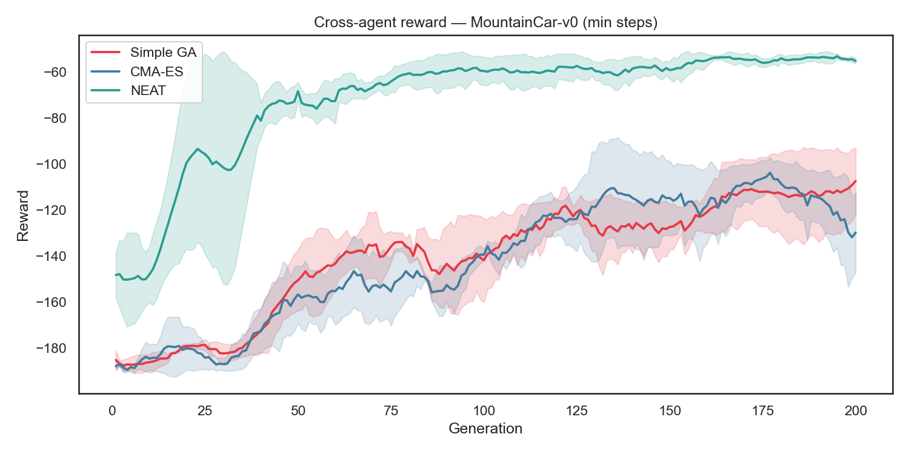
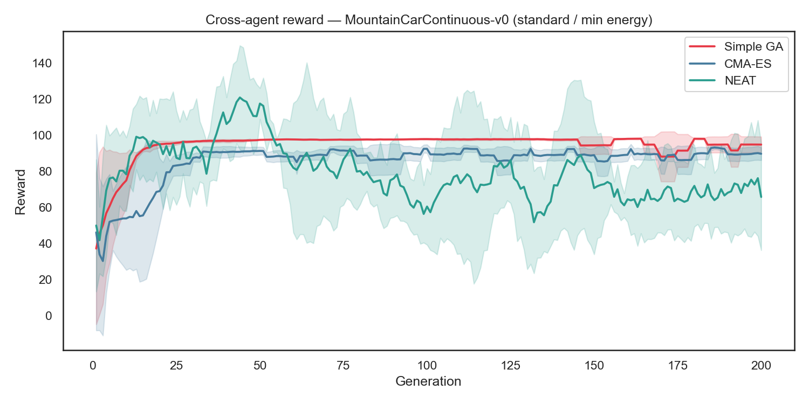
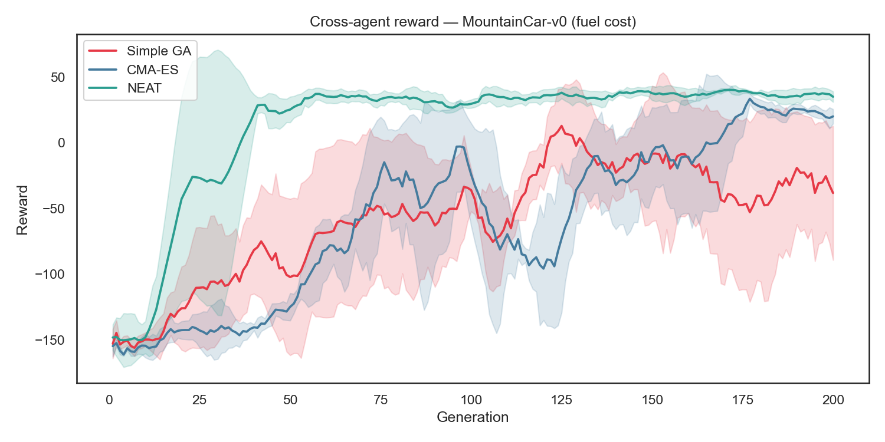
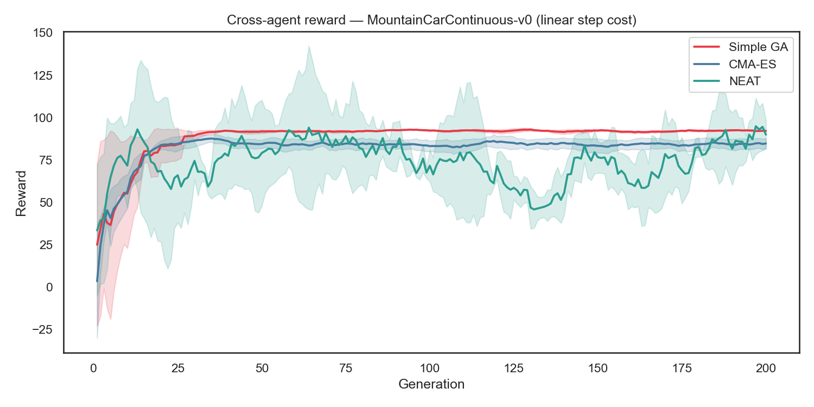

# Evolutionary Algorithms (GA) Report Materials

This document provides the methodology, hyperparameters, quantitative results, and visualizations for the Evolutionary Algorithms baseline experiments on the Mountain Car environment. This covers **Simple Genetic Algorithm (GA)**, **Covariance Matrix Adaptation Evolution Strategy (CMA-ES)**, and **NeuroEvolution of Augmenting Topologies (NEAT)**.

## 1. Methodology Overview

We evaluated the evolutionary algorithms across four variants of the Mountain Car environment to test their robustness and efficiency under different reward landscapes:

1. **MountainCar-v0 (min steps)**: The standard discrete environment where the goal is to reach the flag as quickly as possible. The agent receives a uniform `-1` reward per step.
2. **MountainCarContinuous-v0 (standard / min energy)**: The standard continuous environment. The agent receives a penalty proportional to the squared magnitude of the action, encouraging energy-efficient movement.
3. **MountainCar-v0 (fuel cost)**: A heavily constrained discrete environment. The agent incurs a uniform step cost, but is explicitly rewarded for energy conservation via state augmentation and kinetic energy shaping. A terminal bonus of `+100` is granted for reaching the goal.
4. **MountainCarContinuous-v0 (linear step cost)**: A continuous variant that penalizes actions linearly (`-0.1 * |action|`) instead of quadratically.

## 2. Algorithms and Base Setups

Before environment-specific tuning, we established a baseline configuration for each evolutionary algorithm:

### Simple Genetic Algorithm (Simple GA)
A classic evolutionary approach that maintains a population of neural network weight vectors. It evaluates fitness, selects the top performers (elitism), and generates a new population by adding Gaussian noise (mutation) to the parents' weights.
- **Base Setup**: Population size of 50, elite fraction of 20%, and a standard deviation for mutation (`mutation_std`) of 0.05 to 0.1 depending on the task. The network architecture consists of two hidden layers with 64 units each.

### Covariance Matrix Adaptation Evolution Strategy (CMA-ES)
An advanced numerical optimization method that continuously updates a multi-variate Gaussian distribution (mean and covariance matrix) from which the population of weight vectors is sampled. It is highly efficient on smooth, non-linear landscapes.
- **Base Setup**: Population size of 50. The initial step size (`sigma0`) is set to 0.5, allowing it to explore the local neighborhood of the initial weights. Like Simple GA, it optimizes a fixed 64x64 hidden layer architecture.

### NeuroEvolution of Augmenting Topologies (NEAT)
Unlike Simple GA and CMA-ES, which only optimize weights, NEAT optimizes both weights *and* the network topology itself. It starts with simple networks (no hidden layers) and slowly adds nodes and connections via structural mutations, using speciation to protect new topological innovations.
- **Base Setup**: Population size of 50, no initial hidden nodes. Standard mutation rates were initially set to allow steady growth of connections and nodes.

## 2. Hyperparameter Configurations & Environment-Specific Tuning

For the majority of the environments, standard exploratory parameters were sufficient. However, we discovered that the **MountainCar-v0 (fuel cost)** environment presents a highly deceptive, flat fitness landscape. Because any active movement incurs an energy penalty, agents easily fall into a local minimum where the "safest" policy is to idle at the bottom of the valley, resulting in a consistent but suboptimal reward (approx. `-200`).

To force the evolutionary algorithms to break out of this local minimum and discover the terminal `+100` reward, we performed **environment-specific tuning**, explicitly increasing the exploration variance for the fuel task:
- **CMA-ES**: Increased the initial step size (`sigma0`) from `0.5` to `1.5`.
- **Simple GA**: Increased the mutation standard deviation (`mutation_std`) from `0.05` to `0.5`.

> [!TIP]
> **Talking Point for Report**: Highlighting this environment-specific tuning demonstrates a deep understanding of how deceptive reward landscapes trap gradient-free optimization methods, and how increasing population variance allows them to traverse flat fitness plateaus.

### Structural Mutation Tuning (NEAT)
Initial experiments revealed that NEAT suffered from catastrophic forgetting—learning a good policy early, but eventually collapsing. This was due to high structural mutation rates (adding/deleting nodes and connections) causing the network architectures to blow up. We stabilized NEAT by lowering the probability of structural mutations and increasing species elitism, allowing it to fine-tune weights without constantly destroying its topology.

## 3. Quantitative Results

All values averaged over 3 seeds (7, 21, 42) × 200 training generations. **Bold** = best per column.

### MountainCar-v0 — Min Steps (discrete, energy shaping ×5)

| Algorithm | Mean Reward ± Std | Success Rate | Mean Episode Length |
| :--- | :---: | :---: | :---: |
| Simple GA | -138.48 ± 6.66 | 73.2% | 156.0 |
| CMA-ES | -140.67 ± 6.46 | 70.2% | 155.5 |
| **NEAT** | **-69.32 ± 3.19** | **90.0%** | **134.7** |

### MountainCarContinuous-v0 — Min Energy (standard continuous)

| Algorithm | Mean Reward ± Std | Success Rate | Mean Episode Length |
| :--- | :---: | :---: | :---: |
| **Simple GA** | **95.36 ± 0.67** | **98.5%** | 437.9 |
| CMA-ES | 86.29 ± 1.49 | 94.5% | **383.4** |
| NEAT | 78.74 ± 22.93 | 31.3% | 958.1 |

### MountainCar-v0 — Fuel Cost (−1/step + 100 goal + shaping ×20)

| Algorithm | Mean Reward ± Std | Success Rate | Mean Episode Length |
| :--- | :---: | :---: | :---: |
| Simple GA | -55.08 ± 12.74 | 55.2% | 171.8 |
| CMA-ES | -54.68 ± 16.49 | 52.2% | 172.5 |
| **NEAT** | **17.79 ± 11.10** | **90.7%** | **139.0** |

### MountainCarContinuous-v0 — Linear Step Cost (−0.1|a|/step + 100 goal)

| Algorithm | Mean Reward ± Std | Success Rate | Mean Episode Length |
| :--- | :---: | :---: | :---: |
| **Simple GA** | **89.67 ± 2.36** | 99.0% | **283.8** |
| CMA-ES | 83.01 ± 2.37 | **99.5%** | 290.5 |
| NEAT | 75.08 ± 3.82 | 29.7% | 966.1 |

## 4. Training Monitoring

All training runs emit TensorBoard event files to `outputs/logs/<run_name>/events.out.tfevents.*`. Logged scalars per run: `fitness/mean`, `fitness/max`, `population_std`, `success_rate`, `episode_length`. To open the dashboard:

```bash
tensorboard --logdir outputs/logs --port 6006
# → http://localhost:6006
```

## 5. Visualizations

### Cross-Agent Reward Comparisons

**MountainCar-v0 — Min Steps (discrete)**



**MountainCarContinuous-v0 — Min Energy (standard continuous)**



**MountainCar-v0 — Fuel Cost**



**MountainCarContinuous-v0 — Linear Step Cost**



*(Additional plots — seed envelopes, diversity curves, discrete policy heatmaps, continuous policy surfaces, phase portrait trajectories, feature sensitivity analysis, and NEAT topology animations — are available in `notebooks/04_genetic_algorithms.ipynb` and `outputs/figures/`.)*

## 6. Policy Explanation Summary

**Feature sensitivity** (first-layer weight norms and state-action Pearson correlation across a 40×40 grid):
- `vel` and `KE=0.5v²` are the dominant features across all three algorithms and both discrete scenarios — the optimal bang-bang policy is primarily a function of velocity direction and magnitude.
- `sin(3·pos)` provides a secondary signal, most useful near the goal boundary where it turns negative.
- `pos` alone is the weakest predictor, consistent with the physical intuition that the car's absolute position matters far less than its current momentum.

## 7. Lines of Future Development

1. **Larger CMA-ES budget**: With ~4.7k parameters, covariance estimation requires far more than 10,000 evaluations. 5× budget should reveal CMA-ES's theoretical advantage over Simple GA.
2. **Hybrid NEAT + CMA-ES**: Use NEAT to discover the minimal topology, then CMA-ES to fine-tune weights — combining structural discovery with fast covariance-adapted convergence.
3. **Harder control tasks** (Pendulum-v1, LunarLander-v2): Test whether NEAT's topology flexibility scales to tasks requiring smooth proportional control rather than bang-bang policies.
4. **Parallelised evaluation**: Vectorised fitness evaluation would enable populations of ~500 within the same wall-clock budget, closing the CMA-ES sample gap.
